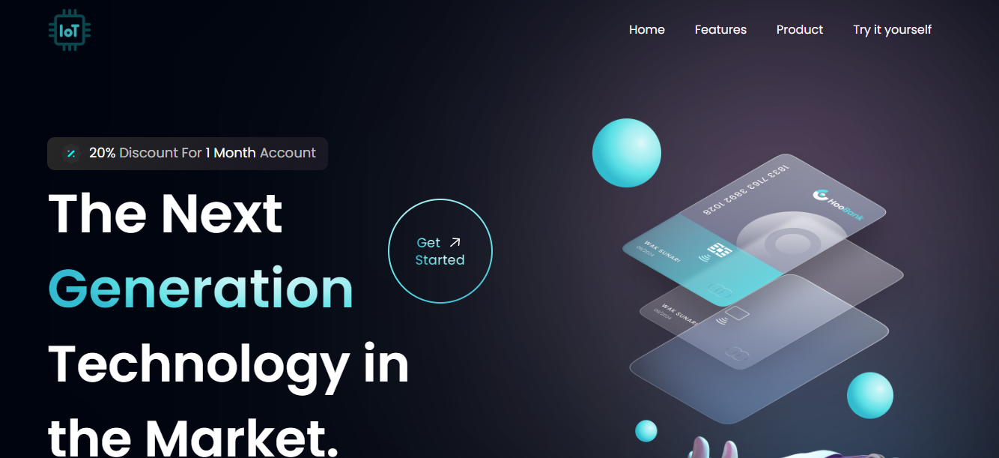

# Website IoT

Es un sitio web del cual esta utilizando una plantilla base en el framework
React, el sitio web contiene un nav en el cual al hacer click te direcciona
a la parte de la pagina correspondiente.

## Home
En este parte de la pagina da una vista previa de lo que trata la pagina

## Features
En este apartado se habla un poco sobre los beneficios que pueden obtener
los clientes sobre la app que se ofrece

## Products
En este apartado el sistio web ofrece algunos productos en venta de los cuales
se pueden utilizar para IoT.

## Try it yourself
Se pone un feedback de lo que han dicho algunos clientes sobre la app y los productos.

En esta parte tenemos una demostracion de lo que es el poder de IoT (internet de las cosas)
hay un sencillo panel donde se tienen dos botones, de encendido y apagado, este al hacer
click y conectarse a una ESP este encendera un led o lo apagara dependiendo de la opcion 
que se elija en el boton

Una vez presionando el boton de encendido se hace una demostracion con un ESP32 en el 
cual este led se enciende

De igual manera al presionar el boton de apagado, este apaga el led del ESP32.
